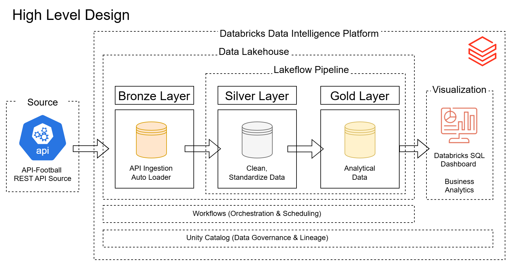
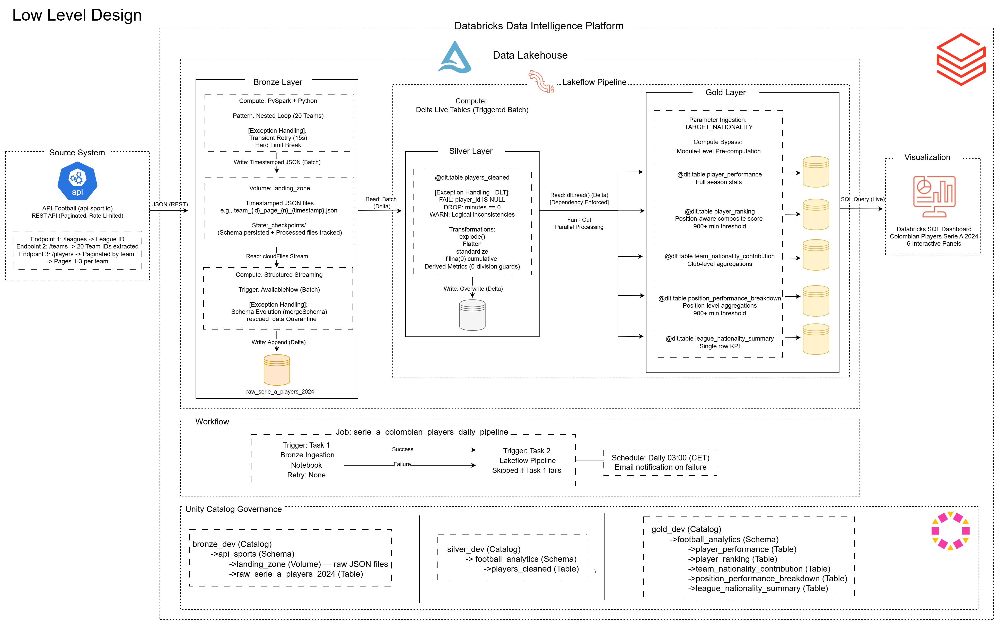
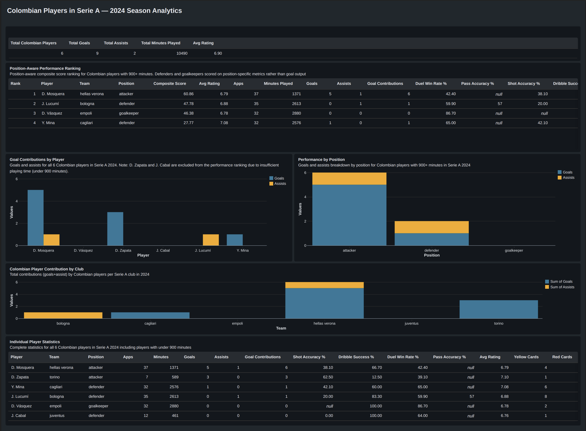

# Colombian Players in Serie A — End-to-End Databricks Lakehouse Pipeline

A production-grade, fully automated data pipeline built on the Databricks Data Intelligence Platform, tracking the performance of Colombian players in Italy's Serie A 2024 season — from raw API extraction to interactive business analytics dashboard.

---

## Project Summary

This project implements a complete end-to-end data platform on 
Databricks, answering a real sports analytics question: **how did 
Colombian players perform in Serie A during the 2024 season?**

The data is sourced from the API-Football REST API — a production-grade 
external API requiring header authentication, dynamic pagination across 
20 Serie A clubs, and defensive programming to handle rate limiting and 
freemium access constraints. The pipeline is architected to mirror a 
live production environment where data arrives continuously — upgrading 
to a paid API subscription activates current season data without any 
architectural changes.

The platform is built entirely within Databricks using the Medallion 
Architecture (Bronze → Silver → Gold), automated via Databricks 
Workflows, and surfaced through a Databricks SQL dashboard — all within 
a single governed Unity Catalog environment.

**Result:** 6 Colombian players identified across 6 Serie A clubs, 
contributing 9 goals, 2 assists, and 10,490 combined minutes across 
the 2024 season — ranked using a position-aware composite scoring 
system that evaluates defenders and goalkeepers on position-specific 
metrics rather than goal output.

---

## Architecture

### High Level Architecture



### Technical Architecture (Low-Level Design)



---

## Dashboard


*Position-aware performance ranking, goal contributions, club analysis, 
and individual player statistics — all sourced directly from governed 
Gold Delta tables via Databricks SQL.*

### Panel Architecture

| Panel | Source Table | Question Answered |
|---|---|---|
| KPI Overview | `league_nationality_summary` | Overall Colombian presence in Serie A |
| Performance Ranking | `player_ranking` | Who performed best by position-aware score? |
| Goal Contributions | `player_performance` | Who scored and assisted? |
| Position Breakdown | `position_performance_breakdown` | Which positions do Colombians excel in? |
| Club Contribution | `team_nationality_contribution` | Which clubs benefited most? |
| Player Statistics | `player_performance` | Complete individual stats |

D. Zapata and J. Cabal are excluded from the Performance Ranking due to insufficient playing time (under 900 minutes). Both players are fully visible in the Player Statistics panel. D. Zapata's 3 goals in only 589 minutes reflects a season disrupted by serious injury.

---

## Key Results

| Metric | Value |
|---|---|
| Colombian Players in Serie A 2024 | 6 |
| Total Goals | 9 |
| Total Assists | 2 |
| Total Minutes Played | 10,490 |
| Average Player Rating | 6.90 |
| Average Pass Accuracy | 57% |
| Average Duel Win Rate | 59.51% |
| Total Yellow Cards | 22 |

Top performer: D. Mosquera (Hellas Verona) — Rank 1, composite score 60.86. 

Most minutes: D. Vásquez (Empoli) — 2,880 minutes as first-choice goalkeeper throughout the season.

---

## Tech Stack

| Technology | Role |
|---|---|
| **Databricks** | Unified platform — ingestion, transformation, orchestration, visualization |
| **Apache Spark / PySpark** | Distributed data processing engine |
| **Delta Lake** | ACID-compliant storage with schema evolution and transaction log |
| **LakeFlow Declarative Pipelines** | Declarative Silver and Gold transformation framework |
| **Databricks Auto Loader** | Incremental file ingestion with checkpoint tracking |
| **Databricks Workflows** | Native pipeline orchestration and scheduling |
| **Databricks SQL Dashboard** | Business analytics visualization |
| **Unity Catalog** | Data governance — 3-level namespace, lineage, access control |
| **API-Football** | Source REST API — player statistics, team and league data |
| **Python** | Extraction engine and pipeline logic |
| **GitHub** | Version control |

**Why Databricks as the unified platform?**
Databricks consolidates every layer of the data engineering stack — 
ingestion, storage, transformation, orchestration, and visualization 
— into a single governed environment. This eliminates integration 
complexity between tools, ensures all data assets are managed under 
Unity Catalog governance from the moment they land, and allows the 
complete pipeline to be monitored, debugged, and maintained from one 
interface. In an enterprise context this reduces operational overhead 
and provides built-in lineage tracking across all layers automatically.

---

## Pipeline Overview

### Medallion Architecture
```
API-Football REST API
        ↓
BRONZE LAYER — bronze_dev.api_sports
raw_serie_a_players_2024
→ Raw, untransformed API payload
→ Incremental append via Auto Loader
→ Schema evolution enabled
        ↓
SILVER LAYER — silver_dev.football_analytics
players_cleaned
→ Flattened, deduplicated, enriched
→ 607 active players, 43+ columns
→ 7 data quality expectations enforced
        ↓
GOLD LAYER — gold_dev.football_analytics
→ player_performance      (6 Colombian players, full stats)
→ player_ranking          (position-aware composite score)
→ team_nationality_contribution  (6 clubs)
→ position_performance_breakdown (3 positions)
→ league_nationality_summary     (1 row KPI)
        ↓
DASHBOARD
Colombian Players in Serie A — 2024 Season Analytics
```

### Orchestration

The complete pipeline is automated via a Databricks Workflows job:

| Setting | Value |
|---|---|
| **Job Name** | serie_a_colombian_players_daily_pipeline |
| **Schedule** | Daily at 03:00 CET |
| **Notification** | Email on failure |
| **Task 1** | Bronze Ingestion Notebook — Retry: None |
| **Task 2** | LakeFlow Pipeline — runs only if Task 1 succeeds |

**Why Retry: None on Task 1?** Each Bronze run consumes approximately 62 of the 100 daily API requests. Automatic retries would risk exhausting the daily quota before the next scheduled run. Failures trigger an immediate email notification — the engineer investigates and reruns manually after the quota resets.

### Key Engineering Decisions

- **Team-based extraction:** The free tier restricts league-wide 
  pagination to 3 pages. Querying by team (20 teams × pages 1-3) 
  retrieves the complete dataset within free tier constraints while 
  maintaining the same schema and data volume as a league-wide query.

- **Distributed file generation:** Unity Catalog Volumes sit over 
  immutable cloud object storage where files cannot be appended to. 
  Each API page is written as a complete immutable JSON file with a 
  unique timestamp, aligning with cloud storage's write-once object 
  model and enabling Spark's parallel file reading.

- **Timestamp-based incremental pattern:** Every pipeline run 
  generates uniquely timestamped filenames, ensuring Auto Loader 
  always detects new files correctly via checkpoint tracking — 
  the incremental ingestion pattern works correctly across all runs 
  without any manual state management.

- **Declarative LakeFlow pipeline:** Silver and Gold are defined as 
  `@dlt.table` decorated functions — LakeFlow handles dependency 
  resolution, infrastructure provisioning, parallel execution, and 
  data quality monitoring automatically without any imperative 
  orchestration code.

- **Position-aware composite scoring:** Player ranking applies 
  separate weight matrices per position — defenders scored on duel 
  win rate and pass accuracy, goalkeepers on saves and rating — 
  with Min-Max normalized metrics eliminating scale bias between 
  absolute counts and percentage metrics.

- **Module-level pre-computation:** Min-Max normalization ranges are 
  computed at module level before any `@dlt.table` decorated function 
  executes, complying with LakeFlow's prohibition of `collect()` 
  inside declarative pipeline functions.

---

## How to Run

### Prerequisites

- Databricks Free Edition account 
  ([sign up](https://www.databricks.com/learn/free-edition))
- API-Football free tier account 
  ([sign up](https://dashboard.api-football.com/register))
- Your API key from api-sports.io dashboard

### Step 1: Clone the Repository
```bash
git clone https://github.com/mavilasantos/serie-a-colombian-players-pipeline.git
```

### Step 2: Connect Databricks to GitHub

1. In Databricks go to **User Settings**
2. Click **Git Integration**
3. Connect your GitHub account
4. Clone the repository into your Databricks workspace

### Step 3: Run Infrastructure Setup

Open and run `01_infrastructure_setup.ipynb` — provisions all Unity 
Catalog infrastructure across all three layers:
```
bronze_dev.api_sports + landing_zone Volume
silver_dev.football_analytics
gold_dev.football_analytics
```

This notebook is idempotent — safe to run multiple times.

### Step 4: Configure Your API Key

Open `02_bronze_ingestion.ipynb` and in **Cell 1** replace the 
placeholder:
```python
API_KEY = "YOUR_API_KEY_HERE"
```

> **Security:** Store your API key in a local `.env` file — the 
> `.gitignore` in this repository excludes it automatically. Never 
> commit credentials to version control.

### Step 5: Configure Pipeline Parameters

In `02_bronze_ingestion.ipynb` **Cell 1:**
```python
TARGET_LEAGUE_NAME = "Serie A"   # Change to target a different league
TARGET_COUNTRY     = "Italy"     # Change to match the league's country
TARGET_SEASON      = "2024"      # Change to target a different season
```

In `lakeflow_pipeline/silver_transformations.py`, update:
```python
BRONZE_TABLE = "bronze_dev.api_sports.raw_serie_a_players_2024"
```

Update this value to match the table generated for your target 
league and season (e.g. `bronze_dev.api_sports.raw_la_liga_players_2025`).

In the LakeFlow pipeline UI go to **Pipeline configuration** → 
**Add configuration** and set:
```
Key:   pipeline.target_nationality
Value: colombia

Key:   pipeline.target_league_id
Value: 135
```

> Both parameters are shared across Silver and Gold — changing 
> `pipeline.target_nationality` redirects all analytical output to 
> any nationality, changing `pipeline.target_league_id` retargets 
> the league filter without editing any code.

### Step 6: Run the Bronze Ingestion Notebook

Open and run all cells in `02_bronze_ingestion.ipynb` sequentially.

Expected output:
```
Pipeline configured for: Serie A, Italy (2024)
League validated. Internal ID: 135
Season validated. Located 20 teams.
Team IDs: [487, 489, ...]
Landing zone folder secured at: /Volumes/bronze_dev/api_sports/landing_zone/serie_a_2024/
Delta table target: bronze_dev.api_sports.raw_serie_a_players_2024
Starting extraction. Run timestamp: 20240315_020000
  Written: team_487_page_1_20240315_020000.json
  ...
Extraction complete. Files landed in: /Volumes/bronze_dev/api_sports/landing_zone/serie_a_2024/
Auto Loader commit complete. Table: bronze_dev.api_sports.raw_serie_a_players_2024
```

> **Expected duration:** approximately 8-10 minutes for 20 teams 
> at the enforced 7-second delay between API requests.

### Step 7: Create the LakeFlow Pipeline

1. In Databricks navigate to **ETL Pipelines** in the left sidebar
2. Click **New Pipeline** → **Start with sample code in Python**
3. Replace the sample files with:
   - `lakeflow_pipeline/silver_transformations.py`
   - `lakeflow_pipeline/gold_transformations.py`
4. In **Pipeline Configuration** set:
   - Default catalog: `gold_dev`
   - Default schema: `football_analytics`
5. Add configuration parameters:
```
   Key:   pipeline.target_nationality
   Value: colombia

   Key:   pipeline.target_league_id
   Value: 135
```
6. Click **Start** to run the pipeline

Expected output: 6 tables created successfully with green checkmarks.

### Step 8: Create the Databricks SQL Dashboard

1. Navigate to **SQL Editor** in the left sidebar
2. Go to **Dashboards** → **Create Dashboard**
3. Name it: `Colombian Players in Serie A — 2024 Season Analytics`
4. Add datasets from the five Gold tables
5. Build the 6 panels referencing the source tables in the Dashboard 
   section above

### Step 9: Set Up Automated Orchestration

1. Navigate to **Workflows** in the left sidebar
2. Click **Create Job**
3. Name the job: `serie_a_colombian_players_daily_pipeline`
4. Add **Task 1:**
   - Name: `bronze_ingestion`
   - Type: Notebook
   - Path: `02_bronze_ingestion`
   - Compute: Serverless
   - Retry: None
5. Add **Task 2:**
   - Name: `lakeflow_transformation`
   - Type: Pipeline
   - Pipeline: your LakeFlow pipeline
   - Depends on: `bronze_ingestion`
6. Set schedule: **Daily at 03:00 (CET)**
7. Add notification: **Email on failure**
8. Click **Save**

---

## Repository Structure
```
├── 01_infrastructure_setup.ipynb      # One-time Unity Catalog provisioning
├── 02_bronze_ingestion.ipynb          # Bronze layer — API extraction pipeline
├── lakeflow_pipeline/
│   ├── silver_transformations.py      # LakeFlow Silver @dlt.table definitions
│   └── gold_transformations.py        # LakeFlow Gold @dlt.table definitions
├── assets/
│   ├── high_level_design.png          # High level architecture diagram
│   ├── low_level_design.png           # Detailed technical architecture diagram
│   └── dashboard_preview.png          # Dashboard preview
├── .gitignore                         # Excludes .env and API credentials
├── README.md                          # This file
└── TECHNICAL_DOCUMENTATION.md        # Complete engineering reference
```

---

## Engineering Decisions & Future Improvements

### Decisions Made

**API quota management:** The Bronze task retry policy is set to None 
rather than the standard automatic retry configuration. Each run 
consumes approximately 62 of the 100 daily API requests — automatic 
retries risk quota exhaustion before the next scheduled run. Failures 
trigger immediate notification for manual investigation and rerun 
after quota reset.

**Historical data with production-ready architecture:** The 2024 
season dataset is historical and static. The pipeline is deliberately 
architected using incremental ingestion patterns (Auto Loader, 
timestamped files, checkpoint tracking) that are immediately 
production-ready for a live updating source — upgrading to a paid 
API subscription activates current season data without any 
architectural changes.

**Single Silver table:** Silver preserves all nationalities and all 
meaningful fields regardless of current Gold requirements. This 
ensures Silver is the canonical clean dataset for the domain — 
business filtering belongs exclusively in Gold.

### Future Improvements

- **Real-time streaming ingestion:** The current pipeline uses Auto 
  Loader with a daily batch trigger — appropriate for a scheduled API 
  source. With a premium API subscription providing a streaming 
  endpoint, the Bronze ingestion could be upgraded to Databricks 
  Structured Streaming with a continuous trigger, processing player 
  statistics updates in near-real-time as matches complete.

- **Paid API subscription:** Upgrading to a paid tier unlocks current 
  season data, activating the incremental Auto Loader pattern for 
  genuine new data on every daily run.

- **CI/CD via Databricks Asset Bundles:** Define the complete project 
  — notebooks, LakeFlow pipeline, Workflows job — as code in YAML 
  using Databricks Asset Bundles, enabling automated deployment via 
  GitHub Actions on every push to main.

- **Retention cleanup job:** The timestamp pattern causes the landing 
  zone to grow indefinitely (~40 files per daily run). A scheduled 
  cleanup job deleting committed files older than a defined window 
  would keep the landing zone manageable at production scale without 
  affecting Auto Loader's checkpoint tracking.

- **Expanded nationality and league analysis:** `TARGET_NATIONALITY` 
  and `TARGET_LEAGUE_NAME` make the pipeline immediately reusable for 
  any combination — Brazilian players in the Bundesliga, Argentine 
  players in La Liga — without code changes.

- **Goalkeeper-specific Gold table:** The Silver layer includes 
  goalkeeper metrics (saves, goals conceded, penalties saved). A 
  dedicated Gold table filtering `WHERE position = 'goalkeeper'` 
  would surface positional performance more completely.

- **Databricks Secrets integration:** Migrate API key management from 
  the local `.env` pattern to Databricks Secrets via 
  `dbutils.secrets.get()` for enterprise-grade credential management.

Full engineering reference covering all architectural decisions, 
technology selection rationale, and implementation details is 
available in [TECHNICAL_DOCUMENTATION.md](TECHNICAL_DOCUMENTATION.md).

---

## Author

**Miguel Angel Avila Santos**

[](https://linkedin.com/in/mavilasantos)
[](https://github.com/mavilasantos)
